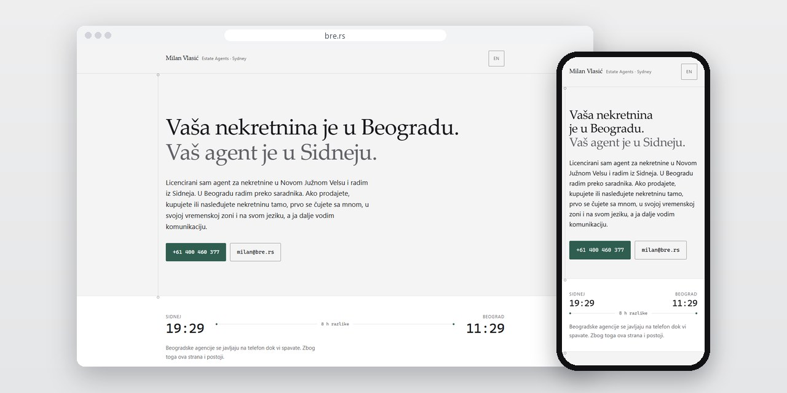
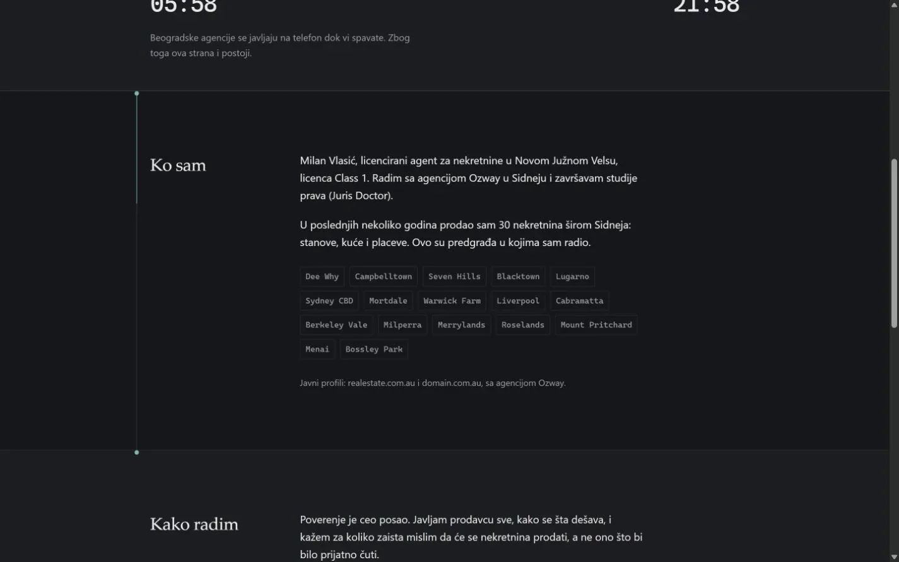
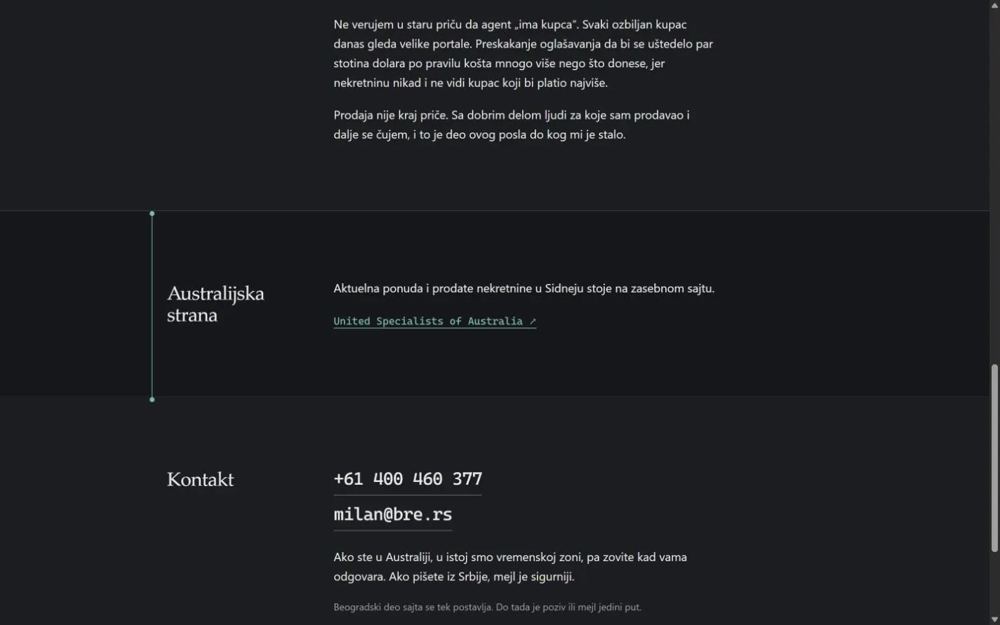

# Milan Vlasić

Lični sajt na srpskom i engleskom za agenta za nekretnine iz Sidneja koji pomaže i vlasnicima iz dijaspore oko nekretnina u Beogradu.

**[bre.rs](https://bre.rs/)** · [Studija slučaja](https://svilenkovic.rs/radovi/milan-vlasic) · [English](README.md)

> [!NOTE]
> Klijentski projekat. Izvorni kod pripada klijentu i čuva se u privatnom repozitorijumu. Ova stranica opisuje šta sam uradio i kako.

<table>
  <tr><td><b>Klijent</b></td><td>Milan Vlasić</td></tr>
  <tr><td><b>Delatnost</b></td><td>Nekretnine, licencirani agent u Novom Južnom Velsu</td></tr>
  <tr><td><b>Lokacija</b></td><td>Sidnej i Beograd</td></tr>
  <tr><td><b>Vrsta</b></td><td>Lični sajt na jednoj strani</td></tr>
  <tr><td><b>Moj deo posla</b></td><td>Dizajn, izrada, SEO, hosting i održavanje</td></tr>
  <tr><td><b>Tehnologije</b></td><td>HTML, CSS, JavaScript, JSON-LD</td></tr>
</table>

## O projektu

Milan Vlasić je licencirani agent za nekretnine u Novom Južnom Velsu. Radi iz Sidneja, a nekretnine u Beogradu vodi preko tamošnjih saradnika, pa mnogi ljudi kojima pomaže žive u jednoj zemlji, a nekretninu imaju u drugoj. Prvi ekran je zato morao da objasni tu vezu, vremensku razliku i kome se posetilac javlja.

Na taj ekran sam stavio koliko je sati u Sidneju, a koliko u Beogradu, i razliku između njih. Razlika se računa iz trenutnog pomaka obe zone, pa ostaje tačna i kada jedna strana pređe na letnje ili zimsko vreme. Srpski i engleski tekst stoje u istom HTML-u i jedno dugme menja jezik bez učitavanja nove strane. Izbor se pamti u pregledaču, a sam sajt ne postavlja kolačiće i nikoga ne prati.

## Šta sam uradio

- Satovi za Sidnej i Beograd sa razlikom u satima, preko Intl.DateTimeFormat i bez biblioteke
- Srpski i engleski na istoj strani: engleski tekst u data atributima, izbor sačuvan u localStorage
- Profil pre ponude: licenca, predgrađa Sidneja u kojima je radio i način rada
- Samo direktan kontakt, uz napomenu koji kanal je bolji iz Australije, a koji iz Srbije
- Linija niz stranu koja se puni skrolom: CSS animacija vezana za skrol, a gde je pregledač ne podržava, mala skripta; uz smanjenje pokreta miruje
- Statički HTML, CSS i JavaScript bez baze, sa strukturisanim podacima za agenta i sajt

## Merenja

| | Performanse | Pristupačnost | Dobre prakse | SEO |
| :-- | :-: | :-: | :-: | :-: |
| Telefon | 100 | 100 | 100 | 100 |
| Desktop | 100 | 100 | 100 | 100 |

PageSpeed Insights, laboratorijsko merenje živog sajta, septembar 2026. Sigurnosna zaglavlja: 6 od 6. HTML validator: bez grešaka. axe provera pristupačnosti: bez prekršaja. Strukturisani podaci: `RealEstateAgent`.

## Snimci ekrana

<table>
  <tr>
    <td width="68%" valign="top"></td>
    <td width="32%" valign="top"></td>
  </tr>
</table>

Lični profil, tržišta i način rada agenta

Australijska strana posla i direktni kontakt

---

Izrada: [D. Svilenković](https://svilenkovic.rs).
